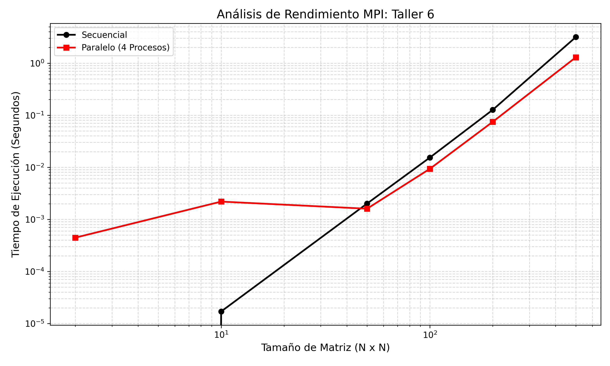

# Multiplicación de Matrices Cuadradas con MPI

Este proyecto implementa la multiplicación paralela de matrices cuadradas (N x N) utilizando la interfaz de paso de mensajes **MPI**. El objetivo es evaluar el rendimiento y la escalabilidad del algoritmo en una arquitectura multicore.

## Características Técnicas
* Memoria Contigua: Uso de punteros simples para mejorar la localidad de datos y eficiencia de la caché.
* Comunicación Colectiva: Implementación con `MPI_Scatter`, `MPI_Bcast` y `MPI_Gather`.
  *Sincronización: Uso de `MPI_Barrier` para mediciones de tiempo precisas.

## Resultados
Se logró un **Speedup máximo de 2.44x** utilizando 4 procesos en matrices de 500x500.

## Cómo Ejecutar
1. Compilar: `mpic++ Taller6.cpp -o Taller6.exe`
2. Ejecutar: `mpiexec -n 4 Taller6.exe 500`
